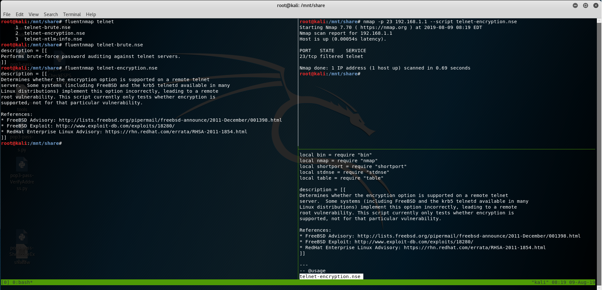

## FluentNmap:

```
 _____ _                  _   _   _                       
|  ___| |_   _  ___ _ __ | |_| \ | |_ __ ___   __ _ _ __  
| |_  | | | | |/ _ \ '_ \| __|  \| | '_ ` _ \ / _` | '_ \ 
|  _| | | |_| |  __/ | | | |_| |\  | | | | | | (_| | |_) |
|_|   |_|\__,_|\___|_| |_|\__|_| \_|_| |_| |_|\__,_| .__/ 
                                                   |_|    

------------------------------------------------------------
 A mate for our Nmap. 
 Clean, Concise and Straightforward.
 Help you to be familiar with nmap scripts.
------------------------------------------------------------
```


## Example:




## Usage:

```shell
# Link to env var PATH dir
        sudo wget https://raw.githubusercontent.com/JohnRyk/FluentNmap/master/fluentnmap.sh -O /bin/fluentnmap
        sudo chmod +x /bin/fluentnmap
# Print the help message
	fluentnmap -h 
# Or
	fluentnmap --help
```

​	


